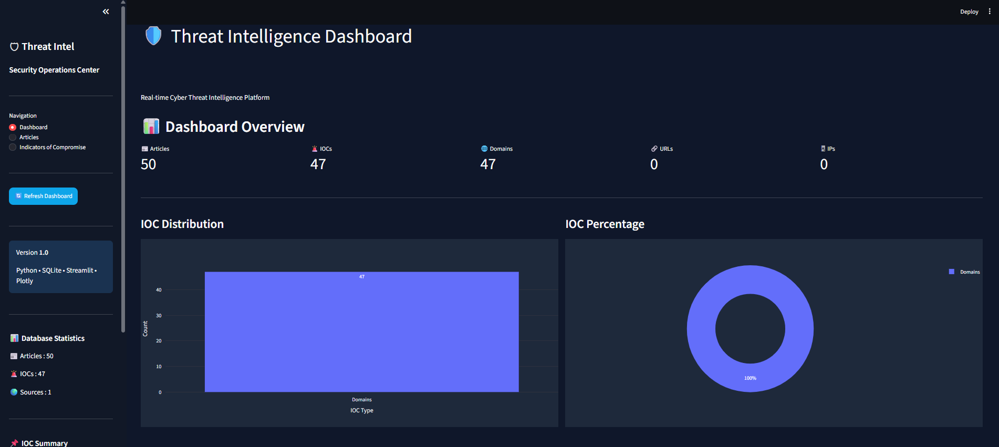
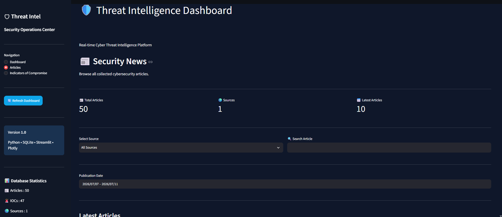
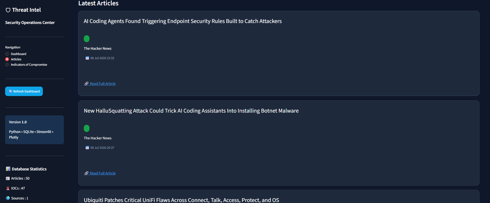
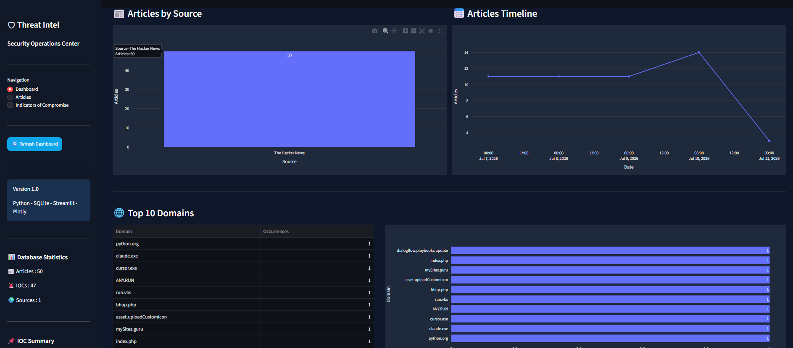
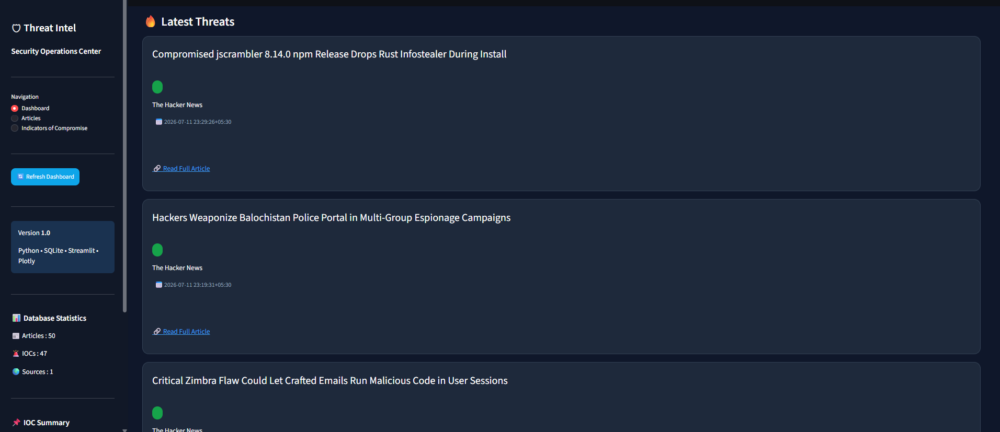
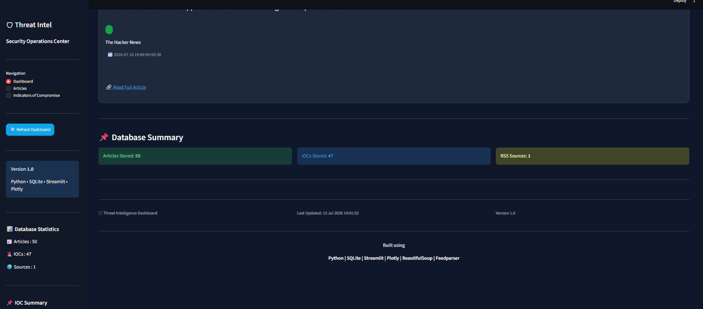
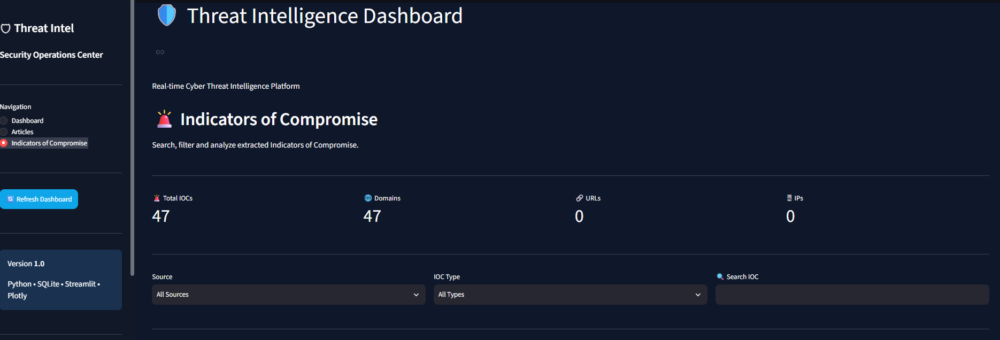
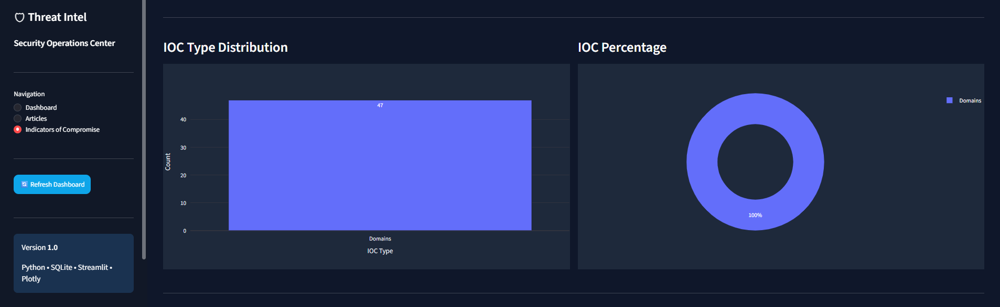
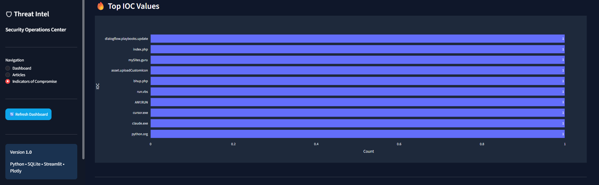
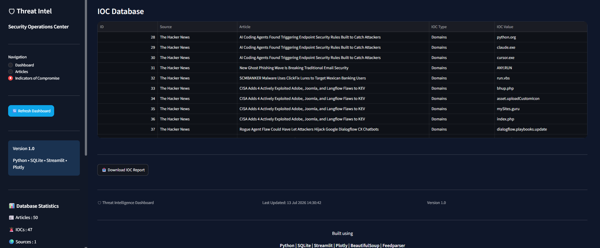

# 🛡 Threat Intelligence Dashboard

A Python-based Threat Intelligence Platform that collects cybersecurity news from multiple RSS feeds, extracts Indicators of Compromise (IOCs), stores them in SQLite, and visualizes them through a Streamlit dashboard.

---

## ✨ Features

- Multiple RSS feeds
- IOC extraction
- SQLite database
- Interactive dashboard
- Search & filters
- CSV export
- Plotly visualizations

---

## 🧰 Technologies

- Python
- Streamlit
- SQLite
- Plotly
- BeautifulSoup
- Feedparser
- Newspaper3k

---

## 🚀 Usage

**Run the scraper** to pull the latest articles and extract IOCs:

```bash
python scraper.py
```

**Launch the dashboard:**

```bash
streamlit run dashboard.py
```

**CLI mode** (if supported):

```bash
python app.py --help
```

---

## 📸 Screenshots

### 🏠 Dashboard Home

<p align="center">
  
</p>

### 📰 Articles Page

<p align="center">
  
</p>

<p align="center">
  
</p>

### 📊 Dashboard Overview & Analytics

<p align="center">
  
</p>

<p align="center">
  
</p>

### 🚨 Latest Threats & Database Summary

<p align="center">
  
</p>

### 🧬 IOC Center

<p align="center">
  
</p>

<p align="center">
  
</p>

<p align="center">
  
</p>

<p align="center">
  
</p>

---

## 🗄 Database

The application stores information in SQLite (`security_news.db`).

### Articles Table

| Column | Type | Description |
|--------|------|-------------|
| id | INTEGER | Primary key |
| title | TEXT | Article title |
| source | TEXT | Feed source |
| url | TEXT | Article URL |
| published | DATETIME | Publish date |

### IOCs Table

| Column | Type | Description |
|--------|------|-------------|
| id | INTEGER | Primary key |
| article_id | INTEGER | Foreign key to Articles |
| ioc_type | TEXT | IP, domain, hash, CVE, URL, email |
| value | TEXT | Extracted indicator |

---

## 📁 Project Structure

```
security_news_scraper/
├── data/
├── screenshots/
├── tests/
├── app.py
├── config.py
├── dashboard.py
├── database.py
├── logger.py
├── parser.py
├── scraper.py
├── requirements.txt
└── README.md
```

---
